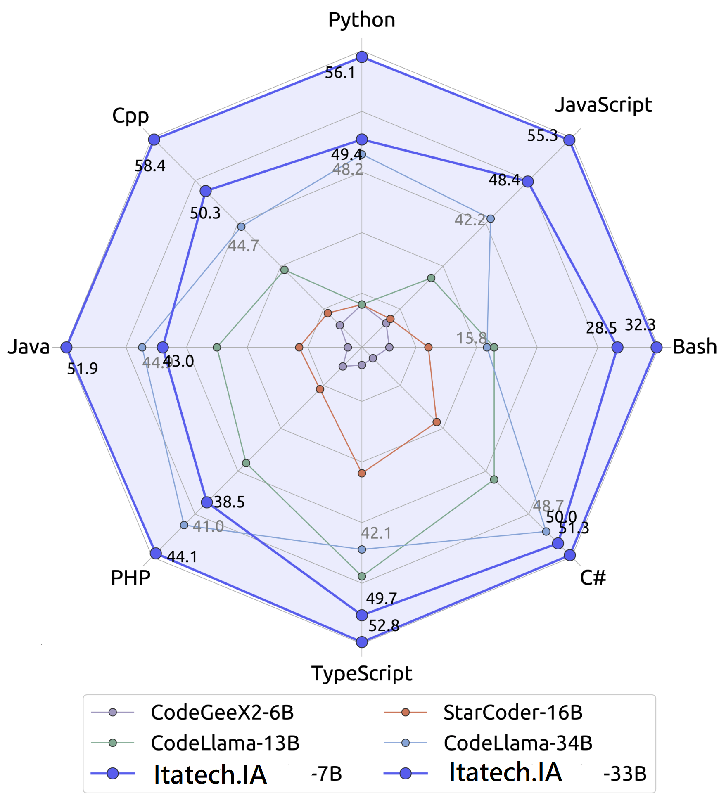
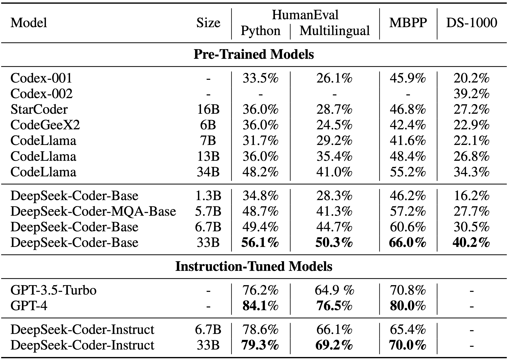
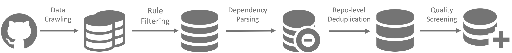
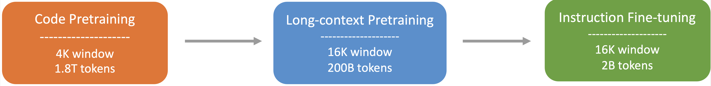
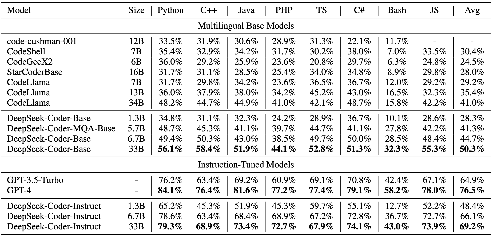
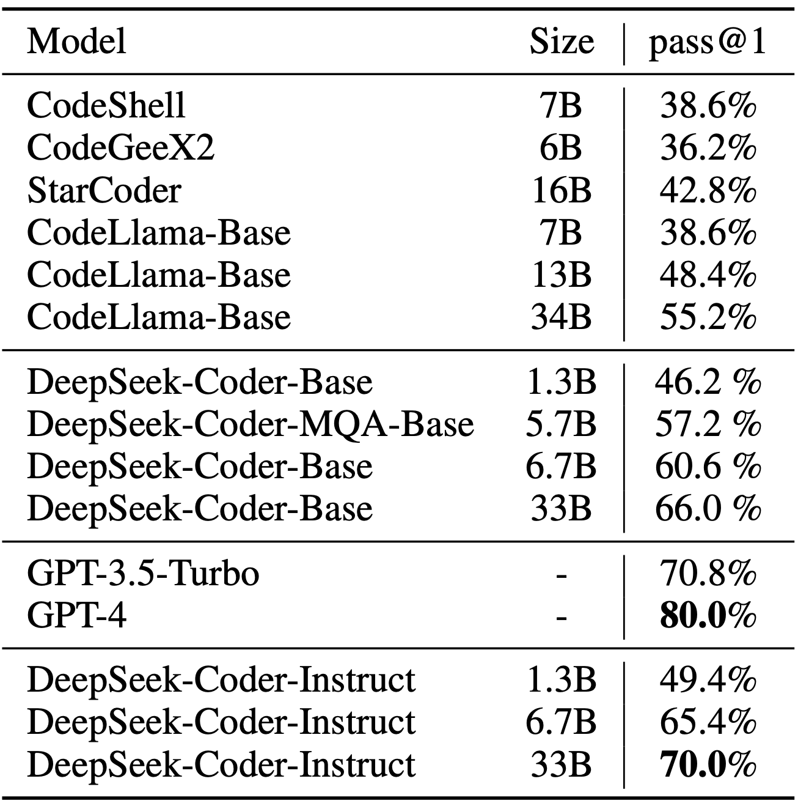
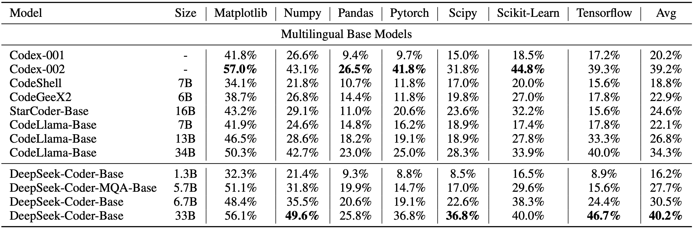
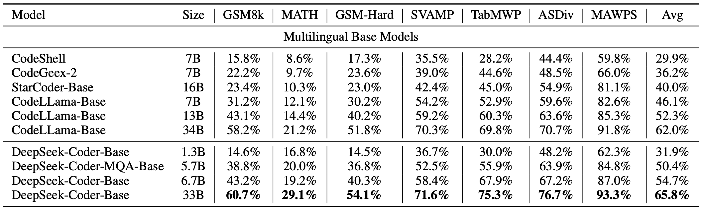

# itatech.IA
A inteligência artificial da empresa Itatech. Um modelo de chatbot ultraavançado.

<p align="center">

</p>
<p align="center"><a href="https://www.itatech.dev@gmail.com/">[ Página inicial]</a> | <a href="https://itatech.dev@gmail.com/">[🤖 Bate-papo com o Itatech.Dev]</a> | <a href="https://linkDownloadDeModelos">[🤗 Download de modelos]</a> | <a href="https://LinkDiscord">[Discord]</a> | <a href="https://github.com/Exemple`">[WeChat (微信)]</a></p>
<p align="center">
<a href="https://huggingface.co/papers/2401.14196"><b>Link do artigo</b>👁️</a>
</p>
<hr>

### 1. Introdução ao DeepSeek Coder

O Itatech.IA é composto por uma série de modelos de linguagem de código, cada um treinado do zero em tokens 2T, com uma composição de 87% de código e 13% de linguagem natural em inglês e chinês. Fornecemos vários tamanhos do modelo de código, variando de versões de 1B a 33B. Cada modelo é pré-treinado no corpus de código de nível de projeto, empregando um tamanho de janela de 16K e uma tarefa extra de preenchimento de lacunas, para dar suporte à conclusão e preenchimento de código de nível de projeto. Para recursos de codificação, o DeepSeek Coder atinge desempenho de ponta entre modelos de código de código aberto em várias linguagens de programação e vários benchmarks.

<p align="center">

</p>

- **Dados de treinamento massivos**: treinados do zero em tokens 2T, incluindo 87% de código e 13% de dados linguísticos em inglês.

- **Altamente flexível e escalável**: oferecido em tamanhos de modelo de 1B, 5,7B, 6,7B e 33B, permitindo que os usuários escolham a configuração mais adequada para seus requisitos.

- **Desempenho de modelo superior**: desempenho de última geração entre modelos de código disponíveis publicamente nos benchmarks HumanEval, MultiPL-E, MBPP, DS-1000 e APPS.

- **Recursos avançados de conclusão de código**: um tamanho de janela de 16K e uma tarefa de preenchimento de lacunas, dando suporte à conclusão de código em nível de projeto e tarefas de preenchimento.

#### Linguagens de programação suportadas
`['ada', 'agda', 'alloy', 'antlr', 'applescript', 'assembly', 'augeas', 'awk', 'batchfile', 'bluespec', 'c', 'c-sharp', 'clojure', 'cmake', 'coffeescript', 'common-lisp', 'cpp', 'css', 'cuda', 'dart', 'dockerfile', 'elixir', 'elm', 'emacs-lisp', 'erlang', 'f-sharp', 'fortran', 'glsl', 'go', 'groovy', 'haskell', 'html', 'idris', 'isabelle', 'java', 'java-server-pages', 'javascript', 'json', 'julia', 'jupyter-notebook', 'kotlin', 'lean', 'literate-agda', 'literate-coffeescript', 'literate-haskell', 'lua', 'makefile', 'maple', 'markdown', 'mathematica', 'matlab', 'ocaml', 'pascal', 'perl', 'php', 'powershell', 'prolog', 'protocol-buffer', 'python', 'r', 'racket', 'restructuredtext', 'rmarkdown', 'ruby', 'rust', 'sas', 'scala', 'scheme', 'shell', 'smalltalk', 'solidity', 'sparql', 'sql', 'stan', 'standard-ml', 'stata', 'systemverilog', 'tcl', 'tcsh', 'tex', 'thrift', 'typescript', 'verilog', 'vhdl', 'visual-basic', 'xslt', 'yacc', 'yaml', 'zig']`

### 2. Resultados da avaliação
Avaliamos o Itatech.IA em vários benchmarks relacionados à codificação.
Apenas os resultados `pass@1` no HumanEval (Python e Multilingual), MBPP e DS-1000 são relatados aqui:

<p align="center">

</p>

O resultado mostra que o Itatech.IA-Base-33B supera significativamente os LLMs de código aberto existentes. Comparado com o CodeLlama-34B, ele lidera em 7,9%, 9,3%, 10,8% e 5,9%, respectivamente, no HumanEval Python, HumanEval Multilingual, MBPP e DS-1000.
Surpreendentemente, nosso Itatech.IA-Base-7B atinge o desempenho do CodeLlama-34B.
O modelo Itatech.IA-Instruct-33B após o ajuste de instruções supera o GPT35-turbo no HumanEval e obtém resultados comparáveis ​​com o GPT35-turbo no MBPP.

Mais detalhes da avaliação podem ser encontrados na [Avaliação detalhada](#6-detailed-evaluation-results).

### 3. Procedimento de criação de dados e treinamento do modelo

#### Criação de dados

- Etapa 1: coletar dados de código do GitHub e aplicar as mesmas regras de filtragem que [StarCoder Data](https://github.com/bigcode-project/bigcode-dataset) para filtrar dados.
- Etapa 2: analisar as dependências de arquivos dentro do mesmo repositório para reorganizar as posições dos arquivos com base em suas dependências.
- Etapa 3: Concatenar arquivos dependentes para formar um único exemplo e empregar minhash de nível de repositório para desduplicação.
- Etapa 4: Filtrar ainda mais o código de baixa qualidade, como códigos com erros de sintaxe ou baixa legibilidade.



#### Treinamento do modelo

- Etapa 1: Inicialmente pré-treinado com um conjunto de dados consistindo de 87% de código, 10% de linguagem relacionada ao código (Github Markdown e StackExchange) e 3% de idioma chinês não relacionado ao código. Os modelos são pré-treinados usando tokens de 1,8T e um tamanho de janela de 4K nesta etapa.
- Etapa 2: Pré-treinamento adicional usando um tamanho de janela estendido de 16K em 200B tokens adicionais, resultando em modelos fundamentais (**DeepSeek-Coder-Base**).
- Etapa 3: Ajuste fino de instruções em 2B tokens de dados de instruções, resultando em modelos ajustados por instruções (**DeepSeek-Coder-Instruct**).



### 4. Como usar
Antes de prosseguir, você precisará instalar as dependências necessárias. Você pode fazer isso executando o seguinte comando:
```
pip install -r requirements.txt

```
Uma demonstração também está disponível no [🤗 Hugging Face Space](https://huggingface.co/spaces/itatech.IA-instruct), e você pode executar a demonstração localmente usando `app.py` na pasta [demo](https://github.com/itatech.IA/main/demo). (Obrigado a toda a equipe do HF pelo suporte)

Aqui estão alguns exemplos de como usar nosso modelo.

#### 1) Conclusão de código
```python
from transformers import AutoTokenizer, AutoModelForCausalLM
import torch
tokenizer = AutoTokenizer.from_pretrained("itatech.IA-6.7b-base", trust_remote_code=True)
model = AutoModelForCausalLM.from_pretrained("itatech.IA/-6.7b-base", trust_remote_code=True, torch_dtype=torch.bfloat16).cuda()
input_text = "#escreva um algoritmo de classificação rápida"
inputs = tokenizer(input_text, return_tensors="pt").to(model.device)
outputs = model.generate(**inputs, max_length=128)
print(tokenizer.decode(outputs[0], skip_special_tokens=True))
```
Este código produzirá o seguinte resultado:
```
def quick_sort(arr):
if len(arr) <= 1:
return arr
pivot = arr[0]
left = []
right = []
for i in range(1, len(arr)):
if arr[i] < pivot:
left.append(arr[i])
else:
right.append(arr[i])
return quick_sort(left) + [pivot] + quick_sort(right)
```

#### 2) Inserção de código
```python
from transformers import AutoTokenizer, AutoModelForCausalLM
import torch
tokenizer = AutoTokenizer.from_pretrained("itatech.IA-6.7b-base", trust_remote_code=True)
model = AutoModelForCausalLM.from_pretrained("itatech.IA-6.7b-base", trust_remote_code=True, torch_dtype=torch.bfloat16).cuda()
input_text = """<｜fim begin｜>def quick_sort(arr):
if len(arr) <= 1:
return arr
pivot = arr[0]
left = []
right = []
<｜fim hole｜>
if arr[i] < pivot:
left.append(arr[i])
else:
right.append(arr[i])
return quick_sort(left) + [pivot] + quick_sort(right)<｜fim end｜>"""
inputs = tokenizer(input_text, return_tensors="pt").to(model.device)
outputs = model.generate(**inputs, max_length=128)
print(tokenizer.decode(outputs[0], skip_special_tokens=True)[len(input_text):])
```
Este código produzirá o seguinte resultado:
```
for i in range(1, len(arr)):
```

#### 3) Inferência do modelo de bate-papo
```python
from transformers import AutoTokenizer, AutoModelForCausalLM
import torch
tokenizer = AutoTokenizer.from_pretrained("itatech.IA-6.7b-instruct", trust_remote_code=True)
model = AutoModelForCausalLM.from_pretrained("itatech.IA-6.7b-instruct", trust_remote_code=True, torch_dtype=torch.bfloat16).cuda()
messages=[
{ 'role': 'user', 'content': "escreva um algoritmo de classificação rápida em python."}
]
inputs = tokenizer.apply_chat_template(messages, add_generation_prompt=True, return_tensors="pt").to(model.device)
# tokenizer.eos_token_id é o id do token <|EOT|>
outputs = model.generate(inputs, max_new_tokens=512, do_sample=False, top_k=50, top_p=0.95, num_return_sequences=1, eos_token_id=tokenizer.eos_token_id)
print(tokenizer.decode(outputs[0][len(inputs[0]):], skip_special_tokens=True))
```
Este código produzirá o seguinte resultado:
```
Claro, aqui está uma implementação simples do algoritmo Quick Sort em Python:

def quick_sort(arr):
if len(arr) <= 1:
return arr
else:
pivot = arr[0]
less_than_pivot = [x for x in arr[1:] if x <= pivot]
greater_than_pivot = [x for x in arr[1:] if x > pivot]
return quick_sort(less_than_pivot) + [pivot] + quick_sort(greater_than_pivot)

# Teste a função
arr = [10, 7, 8, 9, 1, 5]
print("Matriz original:", arr)
print("Matriz classificada:", quick_sort(arr))

Este código funciona selecionando um elemento 'pivot' de o array e particionando os outros elementos em dois subarrays, de acordo com se eles são menores ou maiores que o pivô. O elemento pivô está então em sua posição final. O processo é então repetido para os subarrays.
```

Se você não quiser usar a API fornecida `apply_chat_template` que carrega o template de `tokenizer_config.json`, você pode usar o seguinte template para conversar com nosso modelo. Substitua o `['content']` por suas instruções e as respostas anteriores do modelo (se houver), então o modelo irá gerar a resposta para a instrução dada atualmente.
```
Você é um assistente de programação de IA, utilizando o modelo DeepSeek Coder, desenvolvido pela itatech.IA Company, e você só responde perguntas relacionadas à ciência da computação. Para perguntas politicamente sensíveis, questões de segurança e privacidade, e outras questões não relacionadas à ciência da computação, você se recusará a responder.
### Instrução:
['content']
### Resposta:
['content']
<|EOT|>
### Instrução:
['content']
### Resposta:

```

#### 4) Conclusão de código em nível de repositório
```python
from transformers import AutoTokenizer, AutoModelForCausalLM
import torch
tokenizer = AutoTokenizer.from_pretrained("deepseek-ai/deepseek-coder-6.7b-base", trust_remote_code=True)
model = AutoModelForCausalLM.from_pretrained("deepseek-ai/deepseek-coder-6.7b-base", trust_remote_code=True, torch_dtype=torch.bfloat16).cuda()

input_text = """#utils.py
import tocha
de sklearn importar conjuntos de dados
de sklearn.model_selection importar train_test_split
de sklearn.preprocessing importar StandardScaler
de sklearn.metrics importar accuracy_score

def load_data():
iris = datasets.load_iris()
X = iris.data
y = iris.target

# Padronizar os dados
scaler = StandardScaler()
X = scaler.fit_transform(X)

X_train, X_test, y_train, y_test = train_test_split(X, y, test_size=0.3, random_state=42)

# Converter dados numpy em tensores PyTorch
X_train = torch.tensor(X_train, dtype=torch.float32)
X_test = torch.tensor(X_test, dtype=torch.float32)
y_train = tocha.tensor(y_train, dtype=torch.int64)
y_test = tocha.tensor(y_test, dtype=torch.int64)

return X_train, X_test, y_train, y_test

def avaliar_predições(y_test, y_pred):
return precisão_score(y_test, y_pred)

# model.py
importar tocha
importar tocha.nn como nn
importar tocha.optim como optim
de tocha.utils.data importar DataLoader, TensorDataset

classe IrisClassifier(nn.Module):
def __init__(self):
super(IrisClassifier, self).__init__()
self.fc = nn.Sequential(
nn.Linear(4, 16),
nn.ReLU(),
nn.Linear(16, 3)
)

def forward(self, x):
return self.fc(x)

def train_model(self, X_train, y_train, epochs, lr, batch_size):
criteria = nn.CrossEntropyLoss()
optimizer = optim.Adam(self.parameters(), lr=lr)

# Crie o DataLoader para lotes
dataset = TensorDataset(X_train, y_train)
dataloader = DataLoader(dataset, batch_size=batch_size, shuffle=True)

for epoch in range(epochs):
for batch_X, batch_y in dataloader:
optimizer.zero_grad()
outputs = self(batch_X)
loss = criteria(outputs, batch_y)
loss.backward()
optimizer.step()

def predict(self, X_test):
with torch.no_grad():
outputs = self(X_test)
_, predict = outputs.max(1)
return predict.numpy()

# main.py
from utils import load_data, assess_predictions
from model import IrisClassifier as Classifier

def main():
# Treinamento e avaliação do modelo
"""
inputs = tokenizer(input_text, return_tensors="pt").to(model.device)
outputs = model.generate(**inputs, max_new_tokens=140)
print(tokenizer.decode(outputs[0]))
```

---
No cenário a seguir, o modelo DeepSeek-Coder-6.7B efetivamente chama uma classe **IrisClassifier** e sua função membro do arquivo `model.py` e também utiliza funções do arquivo `utils.py` para complete corretamente a função **main** no arquivo `main.py` para treinamento e avaliação do modelo.


### 5. Como ajustar o DeepSeek-Coder

Nós fornecemos o script `finetune/finetune_deepseekcoder.py` para que os usuários ajustem nossos modelos em tarefas posteriores.

O script suporta o treinamento com [DeepSpeed](https://github.com/microsoft/DeepSpeed). Você precisa instalar os pacotes necessários por:

```bash
pip install -r finetune/requirements.txt
```

Siga o [Formato do conjunto de dados de amostra](https://huggingface.co/datasets/nickrosh/Evol-Instruct-Code-80k-v1) para preparar seus dados de treinamento.
Cada linha é uma string serializada em json com dois campos obrigatórios `instruction` e `output`.

Após a preparação dos dados, você pode usar o script de shell de exemplo para ajustar `deepseek-ai/deepseek-coder-6.7b-instruct`.
Lembre-se de especificar `DATA_PATH`, `OUTPUT_PATH`.
E escolha hiperparâmetros apropriados (por exemplo, `learning_rate`, `per_device_train_batch_size`) de acordo com seu cenário.

```bash
DATA_PATH="<seu_caminho_de_dados>"
OUTPUT_PATH="<seu_caminho_de_saída>"
MODEL="itatech.IA-6.7b-instruct"

cd finetune && deepspeed finetune_itatechia.py \
--model_name_or_path $MODEL_PATH \
--data_path $DATA_PATH \
--output_dir $OUTPUT_PATH \
--num_train_epochs 3 \
--model_max_length 1024 \
--per_device_train_batch_size 16 \
--per_device_eval_batch_size 1 \
--gradient_accumulation_steps 4 \
--evaluation_strategy "no" \
--save_strategy "steps" \
--save_steps 100 \
--save_total_limit 100 \
--learning_rate 2e-5 \
--warmup_steps 10 \
--logging_steps 1 \
--lr_scheduler_type "cosseno" \
--gradient_checkpointing True \
--report_to "tensorboard" \
--deepspeed configs/ds_config_zero3.json \
--bf16 True
```

### 6. Resultados detalhados da avaliação

O código reproduzível para os seguintes resultados de avaliação pode ser encontrado no diretório [Evaluation](https://github.com/itatech.IA/main/Evaluation).
#### 1) Benchmark HumanEval multilíngue


#### 2) Benchmark MBPP


#### 3) Benchmark DS-1000


#### 4) Benchmark de raciocínio matemático com auxílio de programa


### Inferência com vLLM

Você também pode empregar [vLLM](https://github.com/vllm-project/vllm) para inferência de alto rendimento.

**Completamento de texto**

```python
from vllm import LLM, SamplingParams

tp_size = 4 # Paralelismo de tensor
sampling_params = SamplingParams(temperature=0.7, top_p=0.9, max_tokens=100)
model_name = "deepseek-ai/deepseek-coder-6.7b-base"
llm = LLM(model=model_name, trust_remote_code=True, gpu_memory_utilization=0.9, tensor_parallel_size=tp_size)

prompts = [
"Se todos em um país se amam,",
"A pesquisa também deve se concentrar nas tecnologias",
"Para determinar se o rótulo está correto, precisamos"
]
outputs = llm.generate(prompts, sampling_params)

generated_text = [output.outputs[0].text para saída em outputs]
print(generated_text)
```

**Conclusão do bate-papo**

```python
from transformers import AutoTokenizer
from vllm import LLM, SamplingParams

tp_size = 4 # Paralelismo de tensor
sampling_params = SamplingParams(temperatura=0,7, top_p=0,9, max_tokens=100)
model_name = "itatech.IA-6.7b-instruct"
tokenizer = AutoTokenizer.from_pretrained(model_name)
llm = LLM(model=model_name, trust_remote_code=True, gpu_memory_utilization=0,9, tensor_parallel_size=tp_size)

messages_list = [
[{"role": "user", "content": "Quem é você?"}],
[{"role": "user", "content": "O que você pode fazer?"}],
[{"role": "user", "content": "Explique o Transformer brevemente."}],
]
prompts = [tokenizer.apply_chat_template(messages, add_generation_prompt=True, tokenize=False) para mensagens em messages_list]

sampling_params.stop = [tokenizer.eos_token]
outputs = llm.generate(prompts, sampling_params)

generated_text = [output.outputs[0].text para saída em outputs]
print(generated_text)
```

### 7. Perguntas e respostas

#### Poderia Você fornece o arquivo tokenizer.model para quantização do modelo?

O itatech.IA utiliza o [HuggingFace Tokenizer](https://huggingface.co/docs/tokenizers/index) para implementar o algoritmo Bytelevel-BPE, com pré-tokenizadores especialmente projetados para garantir o desempenho ideal. Atualmente, não há uma maneira direta de converter o tokenizador em um tokenizador SentencePiece. Estamos contribuindo para que os métodos de quantização de código aberto facilitem o uso do HuggingFace Tokenizer.

##### GGUF(llama.cpp)

Enviamos um [PR](https://github.com/ggerganov/llama.cpp/pull/4070) para o popular repositório de quantização [llama.cpp](https://github.com/ggerganov/llama.cpp) para oferecer suporte total a todos os pré-tokenizadores HuggingFace, incluindo o nosso.

Enquanto espera que o PR seja mesclado, você pode gerar seu modelo GGUF usando as seguintes etapas:

```bash
git clone https://github.com/DOGEwbx/llama.cpp.git
cd llama.cpp
git checkout regex_gpt2_preprocess
# configure o ambiente de acordo com o README
make
python3 -m pip install -r requirements.txt
# gere o modelo GGUF
python convert-hf-to-gguf.py <MODEL_PATH> --outfile <GGUF_PATH> --model-name deepseekcoder
# use a quantização q4_0 como exemplo
./quantize <GGUF_PATH> <OUTPUT_PATH> q4_0
./main -m <OUTPUT_PATH> -n 128 -p <PROMPT>
```
##### GPTQ(exllamav2)

`ATUALIZAÇÃO:`[exllamav2](https://github.com/turboderp/exllamav2) conseguiu suportar o Huggingface Tokenizer. Baixe a versão mais recente e experimente.

Lembre-se de definir a escala RoPE para 4 para saída correta, mais discussão pode ser encontrada neste [PR](https://github.com/turboderp/exllamav2/pull/189).

#### Como usar o deepseek-coder-instruct para completar o código?

Embora os modelos deepseek-coder-instruct não sejam especificamente treinados para tarefas de conclusão de código durante o ajuste fino supervisionado (SFT), eles mantêm a capacidade de executar a conclusão de código de forma eficaz. Para habilitar essa funcionalidade, você simplesmente precisa ajustar o parâmetro eos_token_id. Defina o eos_token_id como 32014, em oposição ao seu valor padrão de 32021 na configuração itatech.IA-instruct. Essa modificação solicita que o modelo reconheça o fim de uma sequência de forma diferente, facilitando assim as tarefas de conclusão de código.

### 8. Recursos
[awesome-deepseek-coder](https://github.com/iatech.IA) é uma lista com curadoria de projetos de código aberto relacionados ao itatech.IA.

### 9. Licença
Este repositório de código é licenciado sob a Licença MIT. O uso de modelos DeepSeek Coder está sujeito à Licença de Modelo. DeepSeek Coder suporta uso comercial.

Consulte [CÓDIGO DE LICENÇA](CÓDIGO DE LICENÇA) e [MODELO DE LICENÇA](MODELO DE LICENÇA) para obter mais detalhes.

### 10. Citação
```
@misc{deepseek-codificador,
 autor = {Daya Guo, Qihao Zhu, Dejian Yang, Zhenda Xie, Kai Dong, Wentao Zhang, Guanting Chen, Xiao Bi, Y. Wu, Y.K. Li, Fuli Luo, Yingfei Xiong, Wenfeng Liang},
title = {DeepSeek-Coder: Quando o modelo de linguagem grande encontra a programação -- A ascensão da inteligência de código},
journal = {CoRR},
volume = {abs/2401.14196},
year = {2024},
url = {https://arxiv.org/abs/2401.14196},
}
```

### 11. Contato

Se você tiver alguma dúvida, abra um problema ou entre em contato conosco em [itatech.dev@gmail.com](mailto:service@itatech.dev.com).
